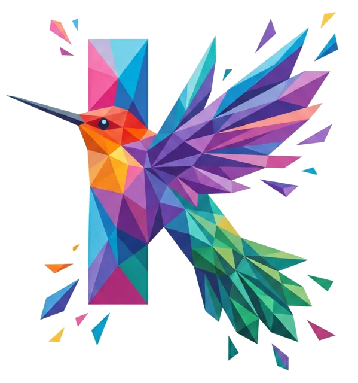

<p align="center">
  
</p>

<h1 align="center">Kolibri</h1>

<p align="center">
  Cliente multi-servicio (WhatsApp Web, Gmail, Outlook, etc.) con Tauri + Rust + Svelte.
</p>

<p align="center">
  <a href="https://github.com/Debaq/kolibri/releases"></a>
  <a href="#"></a>
  <a href="LICENSE"></a>
</p>

Agrupa varios servicios web (WhatsApp, Gmail, Outlook, etc.) en una sola app, usando el WebView del sistema (WebKitGTK / WebView2). Un webview por servicio, sesiones aisladas, tray + atajo global.

> **Nota honesta:** no es especialmente liviano. Cada servicio activo abre su propio WebView con su propio proceso. El consumo de RAM es comparable al de un navegador con esas mismas pestañas abiertas. El valor está en agruparlos bajo una sola ventana, no en optimización de recursos.

## Features

- Tabs por servicio con favicon real, drag-to-reorder
- Cookies/sesión aisladas por servicio (logins independientes)
- Tray icon, atajo global `Ctrl+Alt+K` show/hide
- Notificaciones nativas + badge de no-leídos via parseo de `document.title`
- Auto-suspend de pestañas inactivas (configurable) + toggle "mantener viva"
- Settings: tema, rename, cambio de URL, color, reorder, atajos

## Stack

- **Tauri 2** — shell nativo
- **Rust** — sesiones, tray, notificaciones, hotkeys, persistencia
- **Svelte 5 + TypeScript** — UI bar
- **WebView del SO** — WebKitGTK (Linux), WebView2 (Windows)

## Instalación

Descarga el binario para tu OS desde [Releases](https://github.com/Debaq/kolibri/releases).

### Linux

- **AppImage** — portable, ejecuta directo
  ```bash
  chmod +x Kolibri_*.AppImage
  ./Kolibri_*.AppImage
  ```
- **`.deb`** — Debian/Ubuntu
  ```bash
  sudo dpkg -i kolibri_*_amd64.deb
  ```
- **`.rpm`** — Fedora/openSUSE
  ```bash
  sudo rpm -i kolibri-*.x86_64.rpm
  ```

Dependencias Linux (en distros sin WebKitGTK por defecto):

```bash
# Debian/Ubuntu
sudo apt install libwebkit2gtk-4.1-0 libgtk-3-0
# Fedora
sudo dnf install webkit2gtk4.1 gtk3
```

### Windows

- **`.msi`** o **`.exe` (NSIS)** — instalador estándar. Requiere WebView2 Runtime (preinstalado en Windows 11; Windows 10 lo descarga automático si falta).

## Desarrollo

```bash
pnpm install
pnpm tauri dev
```

## Build local

```bash
pnpm tauri build
# Linux: src-tauri/target/release/bundle/{appimage,deb,rpm}/
# Windows: src-tauri\target\release\bundle\{msi,nsis}\
```

## Releases

Push de un tag `v*` (ej `v0.1.0`) dispara el workflow `.github/workflows/release.yml` que:

1. Builda Linux (AppImage + deb + rpm) y Windows (msi + nsis)
2. Crea un GitHub Release draft con todos los binarios adjuntos

Para publicarlo, edita el draft en GitHub y dale "Publish".

## Notas de upgrade

- **0.1.3 — sesiones por host:** se cambió el almacenamiento de sesiones para que
  servicios con distinto host compartan un único proceso de WebKit/WebView (antes
  era un proceso por servicio, lo que disparaba el uso de RAM). Al actualizar, las
  sesiones de la versión anterior se borran automáticamente y la app muestra un
  aviso pidiendo volver a iniciar sesión en cada servicio. También se agregó
  auto-suspend de pestañas inactivas (configurable en ajustes) y un toggle
  "Mantener viva en segundo plano" por servicio para apps con notificaciones.

## Roadmap

Ver [ROADMAP.md](ROADMAP.md).

## Licencia

MIT
